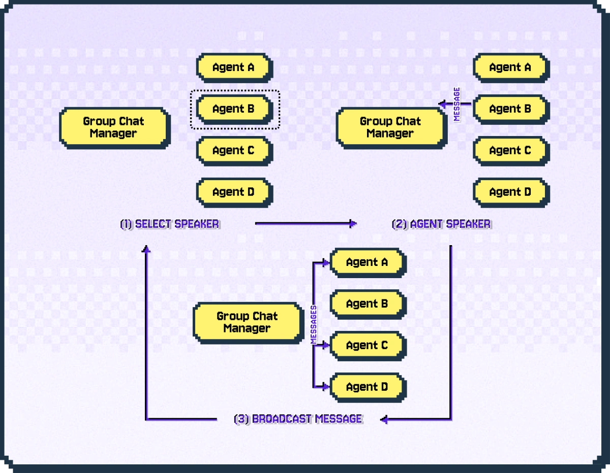

# Building Multi-Agent Systems with AG2

Build production-ready multi-agent applications with [AG2](https://ag2.ai/?utm_source=agents-towards-production&utm_medium=github&utm_campaign=tutorial) (formerly AutoGen). Learn conversation-centric design, dual tool registration, GroupChat orchestration with automatic speaker selection, and production safety patterns.

## **🎯 What You'll Learn**

- **Two-agent conversations** using AssistantAgent and UserProxyAgent for basic LLM-powered tasks
- **Dual tool registration** with `register_for_llm` and `register_for_execution` for clean separation of concerns
- **GroupChat orchestration** with automatic LLM-based speaker selection for multi-agent workflows
- **Production patterns** including termination strategies, human-in-the-loop, and conversation safety

## **📓 Tutorial**

[AG2 Multi-Agent Tutorial Notebook](ag2_tutorial.ipynb)

## **🚀 Run in Google Colab**

## **Requirements**

- **Python 3.10+**
- **AG2** (Open Source) — install via `pip install ag2[openai]`
- **OpenAI API Key** (or any AG2-supported LLM provider)

## **🎓 What You'll Build**

**Multi-Agent Research System** that:

- Uses a Planner agent to break down complex tasks into clear steps
- Deploys a Researcher agent with tool access to gather information
- Employs a Writer agent to create structured reports from findings
- Includes a Reviewer agent for quality assurance with automatic termination
- Orchestrates all agents through GroupChat with LLM-based speaker selection

## **Resources**

- [AG2 Documentation](https://docs.ag2.ai/?utm_source=agents-towards-production&utm_medium=github&utm_campaign=tutorial)
- [AG2 GitHub](https://github.com/ag2ai/ag2?utm_source=agents-towards-production&utm_medium=github&utm_campaign=tutorial)
